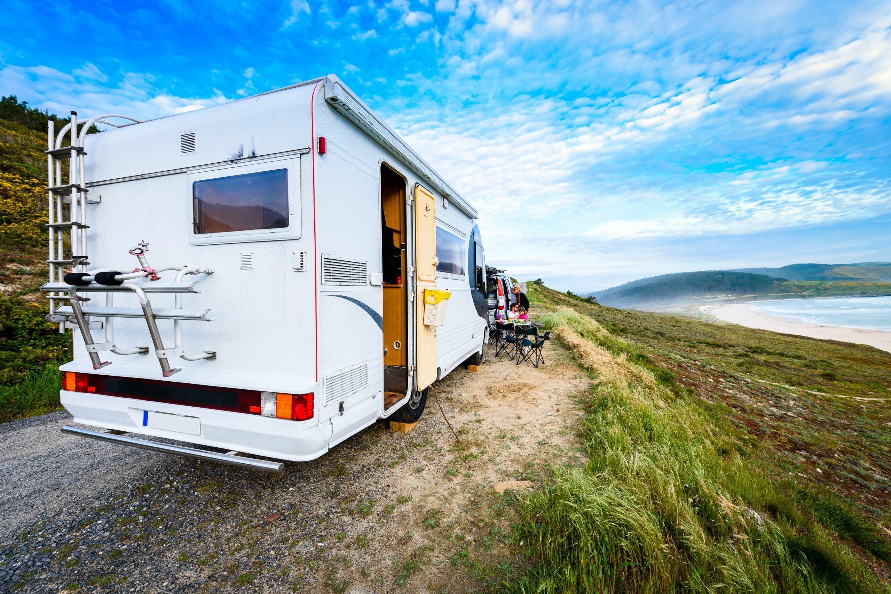

# RENT CAMPERS

The RENT CAMPERS is a web application designed to facilitate the rental process for campers and RVs. It allows users to browse, search, and rent campers for various outdoor adventures such as camping trips, road trips, and vacations. The platform provides a user-friendly interface for both camper owners and renters to manage their listings and bookings.



## Features

### 1. Explore Campers in Ukraine:

Browse a wide variety of campers with detailed info, photos & rental details.

### 2. Save Your Favorites:

Add campers you love to your profile for easy access and comparison.

### 3. Find Your Perfect Camper:

Use advanced filters to narrow down options by equipment, location, and van type.

## How to Use

### 1. Installing Dependencies using npm

```bash
npm install
```

### 2. Starting the Application

```bash
npm start
```

The application will start running locally, and you can access it via your web browser at `http://localhost:3000`.
